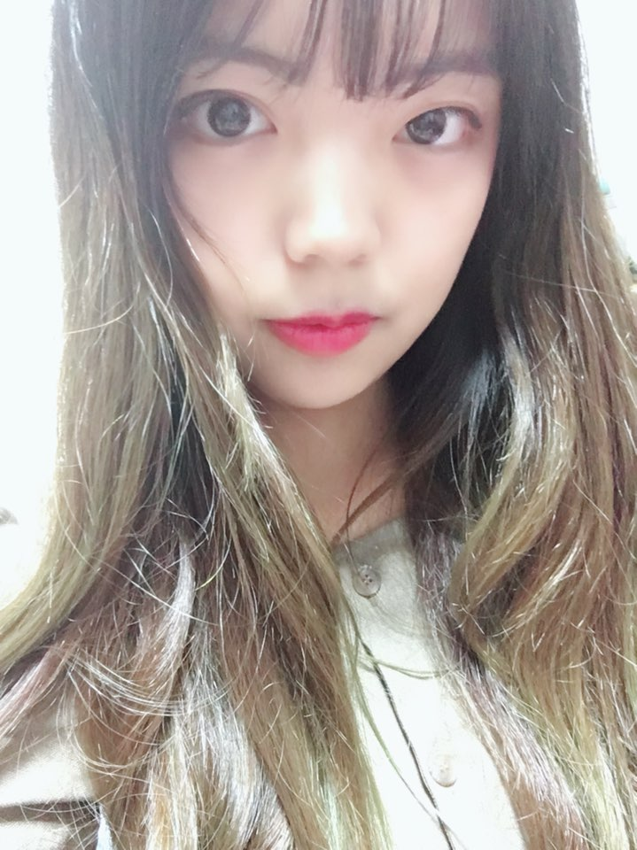

# 이력서

## 소개




- 이름 : 염희수
- 좌우명 : [수적석천](https://hanja.dict.naver.com/word?q=%E6%B0%B4%E6%BB%B4%E7%9F%B3%E7%A9%BF&cp_code=0&sound_id=0)
- 취미 : 음악 감상, 악기 연주(피아노,드럼) 
- email : 2016gmltn@naver.com
- github : https://github.com/yeom-heesu

```
 제 인생의 모토는 수적석천입니다. 
 미미한 물방울이 바위를 뚫는것처럼 
 지금 당장은 엄청난 능력과 무언가를 가지고 있지 않지만,
 꾸준히 노력하면 언젠가는 엄청난 결과를 가져올 것이라는 마음가짐으로 열심히 살고 있습니다.
```

## 성격

  - 저는 외향적인 성격으로, 사람들과 만나는 것을 좋아합니다. 
  
  - 주로 모임을 주도하는 편이며, 어색한 분위기를 싫어하여 항상 활기찬 분위기 형성에 힘쓰는 편입니다.
  
  - 주변사람들은  분위기 메이커라고 말합니다.
  
  - 항상 긍정적으로 생각하고 행동하려 노력합니다.
  
  - 타인에게 피해가 되는 행동을 하지 않으려 합니다.
 
 
 ## 신념 및 마음 가짐
  
  - 노력하면 안되는 것은 없다고 생각합니다.
  
  - 누군가에게 도움이 되는 사람이 되기 위해 노력합니다.
  
  - 매일 '더 나은 나 자신'이 되기위해 잘못된 부분들에 대해 개선 하기 위해 노력합니다.
  
  - '달팽이는 느리지만 뒤로 가지 않는다.' , '노력은 배신하지 않는다.' - 달팽이는 느리게 가지만, 꾸준히 직진하여 자신의 목적지에 도달하게됩니다. 저   또한 달팽이처럼 끈기를 가지고 
  노력하며 살려고 합니다.
  
  - ['내게 코드를 보여주고 자료구조를 숨긴다면 나는 계속 어리둥절할 것이다. 자료구조를 보여준다면 코드는 볼 필요도 없이 뻔한 것이다.'](https://wiki.kldp.org/Translations/html/cathedral-bazaar/x163.html) - 라는 말처럼   프로그램을 잘만든다 코딩을 잘한다의 기준은 자료구조 및 알고리즘이라 생각합니다. 또한 코딩에 있어서 자료구조와 알고리즘을 먼저 구상하려 노력합니다.

## 학력

 - (2012년 3월~2015년 2월) 사우고등학교 졸업
 - (2016년 3월~) 한림대학교

## 교내활동

 - 2016년 컴퓨터공학과 제9대 학생회 UNIC 과대표
 - 2017년 컴퓨터공학과 학술동아리 NONAME 인사부장
 - 2018년 소프트웨어융합대학 봉사동아리 HallymCodeClub 회장

## 봉사활동

 - (2017년 3월~ 2017년 12월) 남춘천중 부설 방신통신중학교 교육도우미
 
 ```
 어려서부터 선생님이 되고싶다는 생각을 했습니다. 
 그 이유는 모두에게 평등하게 교육의 기회를 주고싶었기 때문입니다.
 방송통신중학교는 중학생이아닌 교육의 기회가 없어서 뒤늦게 공부를 시작한 어머니들이 다니는 중학교입니다.
 봉사활동을 하는 1년동안 저는 어머니들에게서 많은 것을 배웠습니다.
 학교 교과서적인 부분에서는 제가 도움을 드렸지만, 
 그분들의 경험과 삶의지혜에서 나오는 지식들을 듣고 보고 배운것은 어디에서도 얻을 수 없는 것이었습니다.
 ```

## 경력사항

 기 간  | 경력 사항
------------- | -------------
 2018   1/10~1/11  | 한림대학교 교직원 3D 특강 보조강사
 2018   1/22~2/2   | 언어청각학부 스크래치 & 3D 교육 보조강사
 2018   2/8~3/29   | 한림대학교 3D 단기 교육 보조강사
 2018    4/3~7/10  | 경기 꿈의 대학 3D & 아두이노 교육 보조강사
 2018    6/25~8/17 | (주)이앤지테크 현장실습인턴
 2018    8/9       | 한림대학교 전공체험 VR부스 운영
 2018    9/15      | 강원중학교 청소년 창업교육(드론) 보조강사
 2018    10/27     | 영주 콩 박물관 3d펜 & 드론 교육강사
 2018   3/5~       | 화천주니어아카데미 스크래치 & 아두이노 교육 보조강사
 2018   11월~      | 한림대학교 컴퓨터그래픽스 및 가상현실연구실 GVE 학부연구원
 
## 수상이력

 - 제1회 한림소프트웨어 헤커톤 dangling else(주제: 학교 실습 시스템 개선) - 우수상
